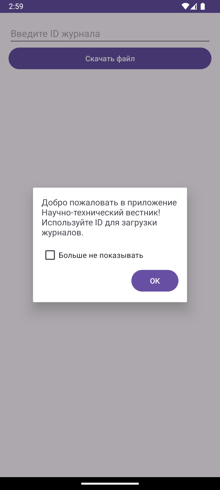
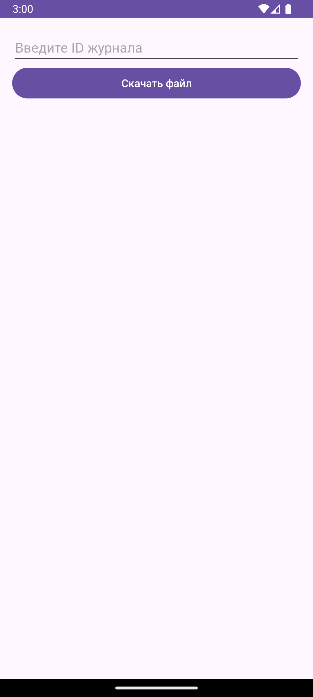
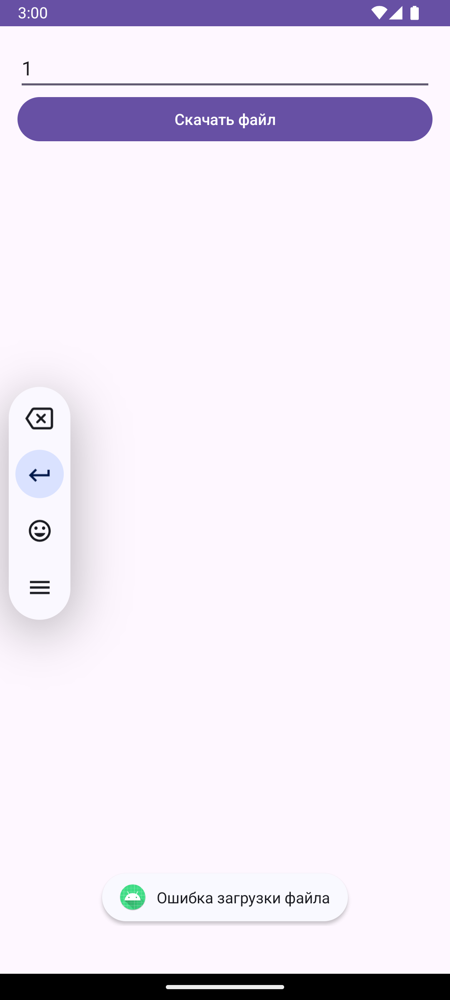

# Лабораторная работа №5: Хранение данных. Настройки и внешние файлы
---
Выполнила: **Мызникова Анастасия**  
Язык программирования: **Java**   
База данных: **SQLite**
---
## Описание приложения
Приложение предоставляет пользователям возможность асинхронно загружать PDF-файлы журнала
"Научно-технический Вестник", хранить их на устройстве, просматривать и удалять их. 
Также приложение сохраняет пользовательские настройки и предоставляет краткую инструкцию по 
использованию. URL для загрузки файлов: http://ntv.ifmo.ru/file/journal/идентификатор_журнала.pdf
- Сохранение:
Все загруженные файлы сохраняются в локальную папку на устройстве, которая создается при первом запуске приложения.
Название и расположение папки задается внутри приложения (например, Documents/NTV_Files).
- Просмотр:
  Нажатие кнопки "Смотреть" открывает сохраненный файл через установленное на устройстве приложение для работы с PDF.
  При отсутствии приложения для просмотра PDF выводится сообщение об ошибке.
- Удаление:
  Нажатие кнопки "Удалить" удаляет выбранный файл с устройства.

---
## Скриншоты

---
# Установка и запуск приложения

Следуйте этим инструкциям, чтобы установить и запустить приложение на своем компьютере.

## Требования

- Установленный [Java JDK](https://www.oracle.com/java/technologies/javase-jdk11-downloads.html) (версия 11 или выше)
- Установленный [Android Studio](https://developer.android.com/studio) (для Android-приложений)

## Установка

1. **Склонируйте репозиторий:**
2. **Перейдите в папку проекта:**
3. **Настройте проект:**
4. **Установите необходимые зависимости:**

## Запуск

1. **Запустите Android-эмулятор или подключите устройство:**
    - Создайте эмулятор в Android Studio через AVD Manager или подключите Android-устройство через USB.

2. **Запустите приложение:**

   Нажмите на кнопку "Run" (Зеленая треугольная кнопка) в Android Studio.